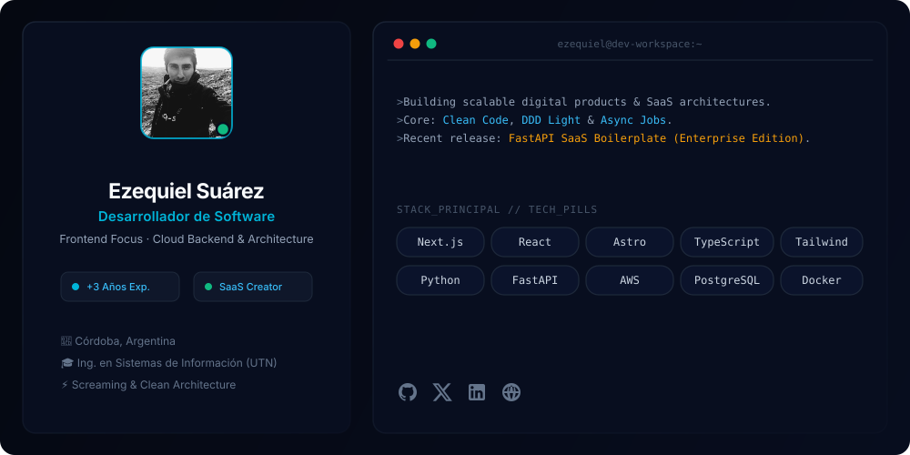

  

# 👋 ¡Hola! Soy Ezequiel Suárez

**Desarrollador de Software** con más de 3 años de experiencia, con un fuerte enfoque en el **Frontend** y una sólida expansión hacia arquitecturas **Backend y Cloud con AWS**.

Combino mis bases teóricas en Ingeniería en Sistemas de Información con una visión orientada a producto y negocio. Construyo aplicaciones modernas integrando **Astro, Next.js, React y TypeScript** en la interfaz, con servicios desacoplados en **Python, FastAPI, bases de datos y arquitectura en la nube** en el backend.

---

### 🚀 Proyectos Destacados & Productos Digitales

* ⚡ **[FastAPI SaaS Boilerplate (Enterprise Edition)](https://www.ezequielsuarez-dev.com/)** *(Comercial en Lemon Squeezy)*  
  Motor backend *production-ready* para lanzar SaaS B2B en tiempo récord. Integra autenticación dual con AWS Cognito (RS256), facturación e idempotencia con Stripe, colas asíncronas con Redis y control de acceso RBAC bajo principios de *Screaming Architecture* con 44 tests automatizados.

* 🎬 **SaaS de Automatización de Video Multi-Tenant**  
  Plataforma orientada a orquestar generación de contenido audiovisual para redes sociales mediante jobs distribuidos, DDD Light, procesamiento asincrónico y desacoplamiento de servicios de extremo a extremo.

---

### 🛠️ Stack Tecnológico

| Área | Tecnologías |
|---|---|
| **Frontend** | Next.js · React · Astro · TypeScript · Tailwind CSS · Sass |
| **Backend & APIs** | Python · FastAPI · SQLAlchemy · REST APIs · Clean Architecture |
| **Cloud & DevOps** | AWS (Cognito, SES) · Docker · CI/CD (GitHub Actions) |
| **Bases de Datos & Colas** | PostgreSQL · MySQL · Redis (ARQ Workers) |

---

### 💼 ¿Trabajamos juntos?

**🚀 Disponible para proyectos freelance y posiciones remotas**  
*"Si buscas a un desarrollador proactivo, con visión global de producto y foco en escalabilidad, ¡hablemos!"*

  
  

### 📫 Canales de Contacto

  
  
  
  

---

### 📊 Actividad en GitHub

  
  

